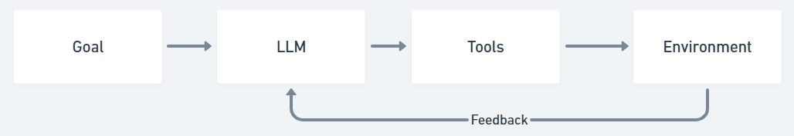
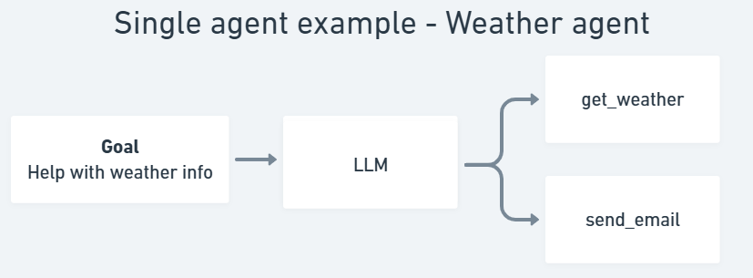
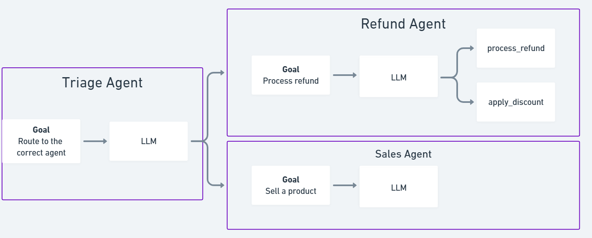

# Agent from scratch
agent-from-scratch is a Python-based repository for developers and researchers to understand the fundamentals of single and multi-agent systems without going through more dense and sophisticated Agent frameworks such as Langgraph and Autogen. In fact, agent-from-sctach is not even a framework, it is single script repository which you can simply download and meddle with it to understand how agents work.

It is a fork of OpenAI's Swarm, which is already straightforward. However, agent-from-scratch is even simpler, making it easier to quickly start and understand single and multi-agent systems.

# Walkthrough video
[](https://youtu.be/gA6T6i8qK-I)

# Whom is this for?
It is for software developers and ML Engineers who would like to understand what are agents and how are they built. This is not a Agent framework. This is simply a python script

# What can you do with this?
There is a single script called `agent.py` in this. It is a very easy read. One can read it and understand what Agents are and how they are built. Once you understand you can either fork this repository or just copy paste the `agent.py` script and start building your own agents.

# Getting started
1. Clone or fork the repository: `git clone https://github.com/hexo-ai/agent-from-scratch.git`
2. To set up the conda environment, run the following command: `conda env create -f environment.yml`. Alternatively, you can use a virtual environment.
3. Create a `.env` file by copying the structure from `.env.template`.
4. Add your environment variables to the `.env` file.
5. Activate the conda environment using `conda activate agent-from-scratch` or your virtual environment.
6. Install the requirements using `pip install -r requirements.txt`.
7. To run the single agent example, execute `python single_agent_example.py`. This script implements a weather agent with capabilities to send emails.
8. To run the multi-agent example, execute `python multi_agent_example.py`. This script implements sales and refund agents with capabilities to apply discounts and process refunds.

# Content
## agent.py
This is the singular script which constructs an Agent. An agent is nothing more nothing lesser than an LLM which can call tools/functions and go in loops to accomplish a goal. Here is an architecture of an Agent. 



A User can assign a goal to an agent. An Agent consists of an LLM and the LLM is capable to calling a bunch of tools. The LLM takes up the goal and uses whichever tool, whenever necessary in order to accomplish the goal. 

1. In `agent.py`, you will see a class called `Agent` which can take up a goal (variable named instructions), an LLM (variable named model) and a bunch of tools (variable named functions). 
2. It has another class called `Swarm` which contains the logic on how the LLM can calls the tools and accomplish the given goal.

```python
class Swarm:
    def __init__():
        # Implements logic of how llm and tool calling works together
            
    def get_chat_completion():
        # Implements LLM completion
        
    def handle_tool_calls():
        # Implements tool calling
        
    def handle_function_result():
        # processes the tool outptu
        
    def run():
        # runs the whole logic of goal -> llm -> tools -> output -> feedback from environment
```

We have included two examples in this repository: namely, `single_agent_example.py` and `multi_agent_example.py`.


## single_agent_example.py
In `single_agent_example.py`, we have a simple implementation of a weather agent. Here are the features of the agent:
1. Goal: To retrieve the weather information for the user
2. llm: gpt-4o
3. tools: get_weather and send_email




## multi_agent_example.py
In the `multi_agent_example.py`, we have a simple implementation of a customer bot multi-agent. There are three agents implemented in it, namely: triage_agent, sales_agent and refund agent



### triage_agent
1. Goal: Route the user request to the correct agent
2. llm: gpt-4o
3. tools: sales_agent, refund_agent

### sales_agent
1. Goal: To sell a product
2. llm: gpt-4o
3. tools: triage_agent

### refund_agent
1. Goal: To process a refund
2. llm: gpt-4o
3. tools: process_refund, apply_discount

# Going deeper
1. [Planning and Reasoning with LLMs](https://hexoai.notion.site/Planning-and-Reasoning-with-LLMs-09ed06fe3a3b45f494760d606c4f285b?pvs=74)
2. [Cognitive Architectures for Language Agents](https://arxiv.org/pdf/2309.02427v3)

# Contributing
Please feel free to fork this repository and create PRs. We are eager to get PRs on the following:
1. Additional working examples of Agents
2. Tracing and Logging of the Agents
3. Feedback and learning from experiences